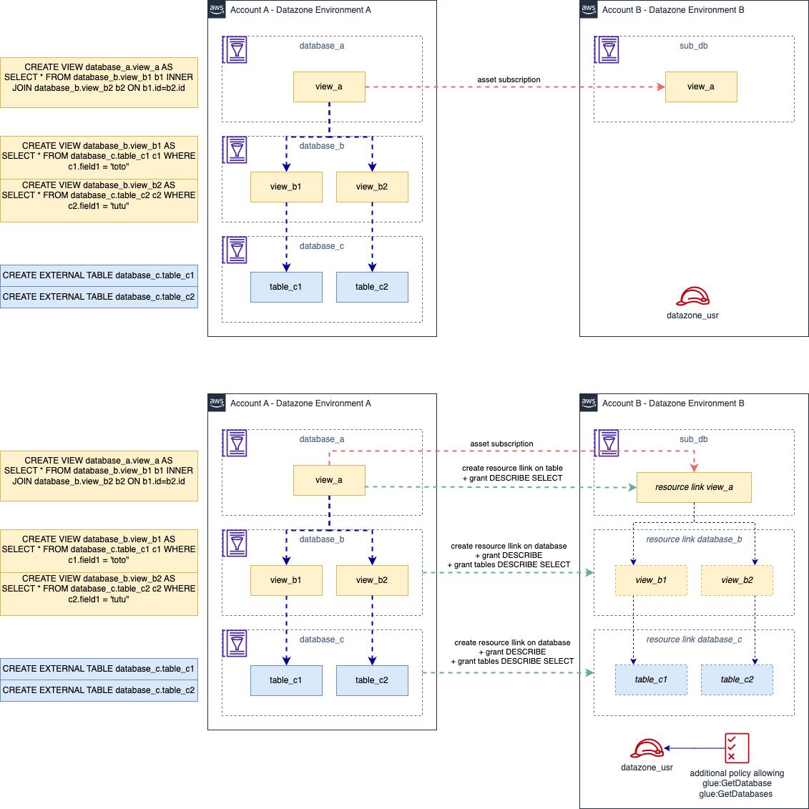
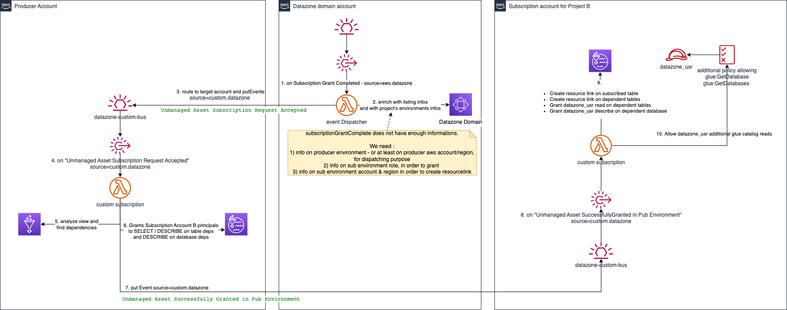
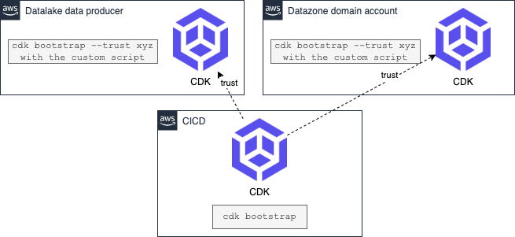

# Datazone View Subscription Proof of concept


## Release Notes

Service Broker API Release Notes

## v0.5.1

* fix managed policy issue

## v0.5.0

* add configuration via file
* Replace inline policy with custom managed policy attachment

## v0.4.0

* remove least privilege on specific Domain. can able all domains
* Fix resourceLink Table Creation on same AwsAccount as environment
* create dedicated Managed Policy

## v0.3.0

* Supports having Subscription Data and Consumer environment in same account

## v0.2.0

* Subscription is done at project level, and not at environment level. 
  * It means that if the project contains multiple environments, the subscription is done one each environment.
  * Change on the dispatching step for environment retrieval (it was wrong, subscription list env was not the requester one, but the source one)
* Stacks Identifier changes, it is required to `cdk destroy --all` on previous tag (v.0.01), then re-deploy

## v0.1.0

* Initial Proto

## Description

This project is a proof of concept on how provide access to Datazone unmanaged assets, with cross account constraints
This is targeted on granting access to Glue View trough Athena.

It handles cascading dependencies between views.

Let's says we have got :
* Database `database_c` :
  * Table `table_c1`
  * Table `table_c2`
* Database `database_b` :
  * View `view_b1` : `SELECT * FROM database_c.table_c1`
  * View `view_b2` : `SELECT * FROM database_c.table_c2`
* Database `database_a` :
  * View `view_a` : `SELECT * FROM database_b.view_b1 b1 INNER JOIN FROM database_b.view_b2 b2 ON b1.id=b2.id`

If we want to subscribe to `database_a.view_a` :
* The process will analyze `database_a.view_a`
  * Find deps on `database_b.view_b1`, `database_b.view_b2`, `database_c.table_c1`, `database_c.table_c2`
* Create a resource link table of `database_a.view_a` in sub_db database
* Create a resource link database of `database_b` in sub_db database
  * Grant DESCRIBE on resource link target `database_b`
  * Grant DESCRIBE, SELECT on table `database_b.view_b1`
  * Grant DESCRIBE, SELECT on table `database_b.view_b2`
* Create a resource link database of `database_c` in sub_db database
  * Grant DESCRIBE on resource link target `database_c`
  * Grant DESCRIBE, SELECT on table `database_c.table_c1`
  * Grant DESCRIBE, SELECT on table `database_c.table_c2`

> Please note that additional policy is required and is created dynamically to allow querying cross-account Glue Catalog

So Subscribed asset `database_a.view_a` appears in the Consumer Database `_sub_db` is queryable.



Here the architecture and process.



## Steps

- Create a Datazone domain, a project in account A
- configure and deploy a Datazone environment in account B
- in account B resides Glue Database and Glue Tables/Views (prerequisite or to be created manually)
- Edit `./config/sandbox.config.json` (Note that you can create your own `xyz.config.json`. You will have to pass -c config=xyz to cdk commands )
  - replace `YOUR_DOMAIN_ID` by the Datazone domain of account A
  - replace `YOUR_DATAZONE_DOMAIN_AWS_ACCOUNT_ID` by the Aws Account id of the Datazone domain (account A)
  - replace `YOUR_DATAZONE_DOMAIN_AWS_REGION` by the Region of the Datazone domain
  - replace `YOUR_DATAZONE_ENVIRONMENT_AWS_ACCOUNT_ID` by the Aws Account id of the Datazone environment (account B), where your data resides
  - replace `YOUR_DATAZONE_ENVIRONMENT_AWS_REGION` by the Region of the Datazone Environment domain, where your data resides in account B
- Bootstrap CDK in accounts (see bellow)
- Deploy with `cdk deploy --all` or `cdk deploy --all -c config=xyz`


## Bootstrap the account for use with CDK

> You need to bootstrap all accounts where you want to deploy resources  with CDK



### Bootstrap the CICD Account

```bash
cdk bootstrap
```

### Bootstrap the Target Accounts

pre-requisite :
* you are a Lakeformation Administrator
* jq is installed
* `export AWS_PROFILE=xxxx` for the target account to CDK bootsrap

following script:
* keep existing trust on previously CDK bootstrap & trusted environments
* Add CDK deploy role from boostraped environment as a LakeFormation Administrator
  * To be allowed to grant LakeFormation capabilities from CDK

```bash
CDK_DEPLOYMENT_ACCOUNT=xyz

# Checking first if CDK has already been bootstrapped here and eventually add the deploy account in the trust
CURRENT_TRUSTED_ACCOUNTS=$(aws cloudformation describe-stacks --stack-name CDKToolkit --query 'Stacks[0].Parameters[?ParameterKey==`TrustedAccounts`].ParameterValue' --output text)
echo $CURRENT_TRUSTED_ACCOUNTS

if [[ "$CURRENT_TRUSTED_ACCOUNTS" == *"$CDK_DEPLOYMENT_ACCOUNT"* ]]
then
  echo "account already in the trust list"
  TRUSTED_ACCOUNTS=$CURRENT_TRUSTED_ACCOUNTS
else
  echo "not in the trust list add it"
  TRUSTED_ACCOUNTS=${CDK_DEPLOYMENT_ACCOUNT}${CURRENT_TRUSTED_ACCOUNTS:+,$CURRENT_TRUSTED_ACCOUNTS}
fi

CURRENT_REGION=$(aws configure get region)
CURRENT_ACCOUNT=$(aws sts get-caller-identity --query Account --output text)
cdk bootstrap --trust $TRUSTED_ACCOUNTS --cloudformation-execution-policies arn:aws:iam::aws:policy/AdministratorAccess aws://${CURRENT_ACCOUNT}/${CURRENT_REGION}

# add cdk exec role as LakeFormation administrator
CDK_QUALIFIER=$(aws cloudformation describe-stacks --stack-name CDKToolkit --query 'Stacks[0].Parameters[?ParameterKey==`Qualifier`].ParameterValue' --output text)

CDK_ROLE_TO_GRANT=cdk-${CDK_QUALIFIER}-cfn-exec-role-${CURRENT_ACCOUNT}-${CURRENT_REGION}
# check role existence 
CDK_ROLE_ARN_TO_GRANT=$(aws iam get-role --role-name $CDK_ROLE_TO_GRANT --query 'Role.Arn' --output text)

# assign as DatalakeAdministrator

EXISTING=$(aws lakeformation get-data-lake-settings --query "DataLakeSettings.DataLakeAdmins[?DataLakePrincipalIdentifier=='"$CDK_ROLE_ARN_TO_GRANT"'].DataLakePrincipalIdentifier" --output text)
if [ -z "$EXISTING" ];
then
      echo "$CDK_ROLE_ARN_TO_GRANT is not yet a lakeformation administrator, let's assign it."
      
      # Following retrieve current Lf settings, add the Role_arn into the array of DataLakeAdmins, then push it to Lf
      aws lakeformation get-data-lake-settings --output json  \
          | jq ".DataLakeSettings.DataLakeAdmins += [{\"DataLakePrincipalIdentifier\": \""$CDK_ROLE_ARN_TO_GRANT"\" }]" \
          | xargs -0 aws lakeformation put-data-lake-settings --cli-input-json
          
      echo "done"
else
      echo "$CDK_ROLE_ARN_TO_GRANT is already a lakeformation administrator, do nothing."
fi
```

## Useful commands

* `npm run build`              compile typescript to js
* `npm run watch`              watch for changes and compile
* `npm run test`               perform the jest unit tests
* `cdk deploy --c config=xyz`  deploy this stack to your default AWS account/region
* `cdk diff --c config=xyz`    compare deployed stack with current state
* `cdk synth --c config=xyz`   emits the synthesized CloudFormation template

## Backlog

- [x] Simplify the dispatched events
- [ ] Publish the subscription state back to the Datazone domain. Unsure if its even possible yet.
- [ ] Support un-publish by removing grants on related resources
- [ ] Provide more accurate SQL dependencies, on special SQL statements (UNNEST, ...)
  - [ ] try a Presto parser
  - [ ] try a bedrock analysis with Claude2
- [x] Add CustomResource to add the environment stack lambda role as a LakeFormationAdministrator
- [ ] Prepare a manual procedure to remove Subscription item
  - [ ] Remove ResourceLink
  - [ ] Revoke Grants on datazone _usr
- [ ] What if the view is updated
- [x] Switch role inline policy to custom managed policy, in order to not block the environment deletion
- [ ] Keep track of all subscriptions (including Glue Table managed assets) in order to properly handle unsubscribe actions.
- [ ] add DLQ handling
- [ ] handle lakeformation API throttling

## Warning

- An IAM Managed policy is attached to datazone_usr environment role.